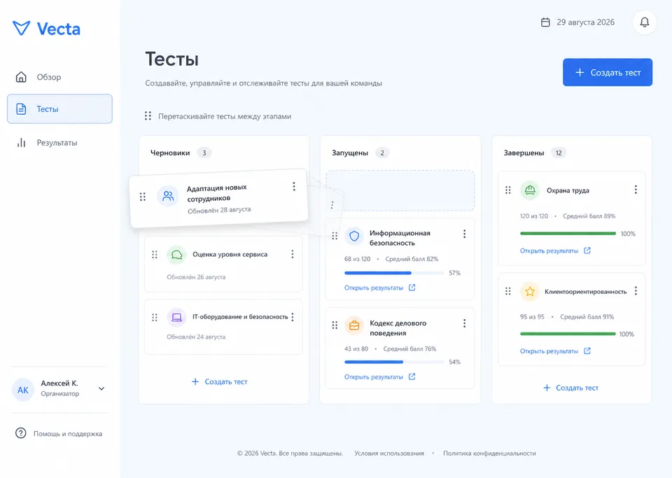

# Vecta

Vecta — русскоязычная assessment-first платформа для корпоративного тестирования: организаторы создают и публикуют тесты, управляют доступом, следят за прохождением и анализируют результаты, а участники проходят тест по коду или персональной ссылке без постоянного аккаунта.

> Vecta 1.0 — полный breaking-change ревамп прежней Survey Platform. Firebase и legacy UI удалены; старые данные намеренно не мигрируются.

[Public staging](https://vecta-staging-public.alimbekov1234567890.workers.dev) · [Organizer staging](https://vecta-staging-organizer.alimbekov1234567890.workers.dev) · [Статус проекта](PROJECT_STATUS.md)



## Возможности

- Drag-and-drop доска с этапами «Черновики», «Запущены» и «Завершены», включая безопасные обратные переходы.
- Редактор single choice, multiple choice и rating scale с последовательным автосохранением и optimistic revision.
- Публикации с неизменяемыми версиями, открытым кодом/QR или одноразовыми приглашениями.
- Восстанавливаемые попытки, серверный дедлайн, последовательное сохранение ответов и идемпотентная отправка.
- Результаты, анализ вопросов, история публикаций, поиск, пагинация и защищённый CSV-экспорт.
- Открытая регистрация по email: после подтверждения шестизначного кода пользователь получает личное пространство организатора.
- Строгая tenant/membership authorization без общей привилегированной Super Admin-роли.
- Responsive UI, keyboard drag-and-drop, focus-trapped dialogs и доступные таблицы/графики.

## Стек и архитектура

- React 19, TypeScript strict, React Router, dnd-kit, Manrope и Phosphor Icons.
- Cloudflare Worker + Static Assets; `/api/*` всегда исполняется сервером.
- Cloudflare D1 с последовательными миграциями и immutable publication snapshots.
- Бесплатный Cloudflare Turnstile, Cloudflare Rate Limiting, HMAC/JOSE, HttpOnly sessions и Resend email OTP.
- Vitest для unit-тестов и Cloudflare Vitest plugin для Worker/D1 integration-тестов.

```text
Browser ── Static Assets ── React SPA
   │
   └── /api/* ── Cloudflare Worker ── D1
                    │
                    ├── Turnstile / Rate Limiting
                    └── Resend (organizer OTP)
```

Основные каталоги:

- `src/vecta/` — production UI и клиентская orchestration.
- `worker/` — API, authentication, authorization и persistence boundary.
- `shared/` — domain-типы, validation и scoring.
- `migrations/` — D1 schema migrations.
- `tests/` — unit и Worker/D1 integration tests.
- `docs/` — продуктовые решения, threat model и runbooks.

## Локальный запуск

Требуется Node.js 22 LTS и npm.

```bash
npm ci
npm run db:migrate:local
npm run db:seed:local
npm run dev
```

Приложение и Worker запускаются одной командой. Health-check: `http://localhost:5173/api/health`. Локальные identity разрешены только для `localhost`/`.test` при `APP_ENV=local`.

## Проверки

```bash
npm run quality
```

Gate включает typecheck, ESLint с `no-floating-promises`, unit-тесты, Worker/D1 integration-тесты, production build и полный `npm audit`. GitHub Actions запускает тот же набор на push и pull request.

После изменения Cloudflare bindings:

```bash
npm run cf:typegen
```

## Развёртывание

Environment выбирается **во время Vite build**. Нельзя собирать local bundle и затем подменять bindings флагом `wrangler deploy --env`.

```bash
npm run build:staging:public
npx wrangler deploy

npm run build:staging:organizer
npx wrangler deploy
```

Production D1 и конфигурация подготовлены отдельно. Пошаговая настройка secrets, Turnstile hostnames, migrations, smoke и rollback находится в [Deployment Runbook](docs/DEPLOYMENT.md). Состояние внешних release-gates — в [PROJECT_STATUS.md](PROJECT_STATUS.md).

## Безопасность

- В Git запрещены `.env*`, `.dev.vars*`, API keys, private keys, service-account JSON, локальные D1 и generated artifacts.
- Коды доступа, invitation tokens, OTP и organizer session tokens хранятся только как HMAC digests.
- Participant API не возвращает answer key; балл показывается только при явной настройке организатора.
- CSV нейтрализует spreadsheet formula injection и ограничен 10 000 строками.
- Organizer mutations требуют authenticated membership и same-origin контекст.
- Production не использует общий access code или локальную identity-заглушку.

Подробнее: [Security Threat Model](docs/SECURITY_THREAT_MODEL.md), [Organizer Auth Runbook](docs/ORGANIZER_AUTH_RUNBOOK.md) и [Permission Matrix](docs/PERMISSION_MATRIX.md).

## Документация

- [Product Spec](docs/PRODUCT_SPEC.md)
- [API Contract](docs/API_CONTRACT.md)
- [Data Model](docs/DATA_MODEL.md)
- [UX Route Map](docs/UX_ROUTE_MAP.md)
- [Decisions](docs/DECISIONS.md)
- [Strict Development Plan](docs/STRICT_DEVELOPMENT_PLAN.md)
- [Deployment Runbook](docs/DEPLOYMENT.md)
- [Vecta 1.0 Release Notes](docs/RELEASE_NOTES_V1.md)

## Git workflow

Разработка полного ревампа ведётся в `feat/vecta-rebuild`. Доставка — один breaking-change pull request в `main`; merge выполняется только после review владельца.
